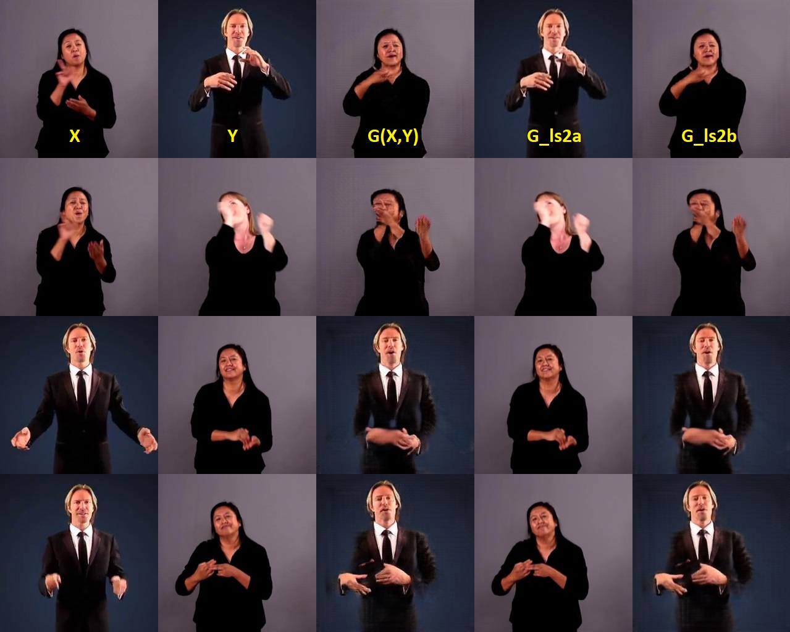

# FusionGAN
 
Generating a Fusion Image: One’s Identity and Another’s Shape https://arxiv.org/pdf/1804.07455.pdf

My result after 100 epochs : 

## Dependencies :

- PyTorch v1.10 ( to install pytorch go to https://pytorch.org/get-started/locally/) include :
    - torchvision v0.11
    - Pillow v9.0.0
- OpenCV v4.5.5 (`pip install opencv-python`)

## How run the learning :

- Download the dataset [here](https://drive.google.com/drive/folders/1waOPQYOmQF1k0pT50uqp6STzYDdSv_5N)
- Unzip the dataset in `Dataset` folder
- Run the learning script `> python learn.py`

